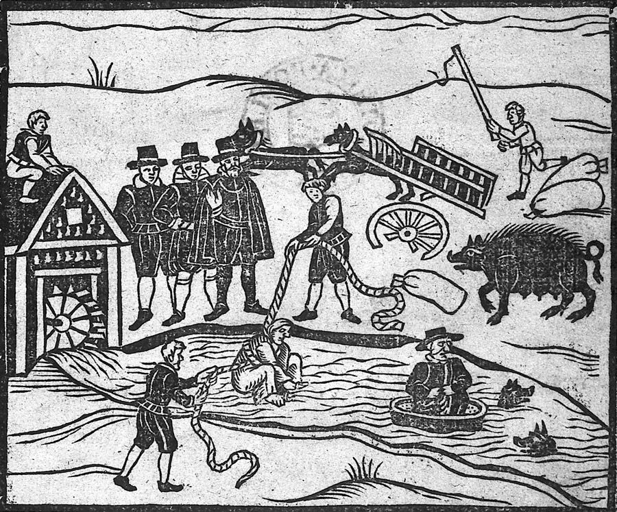
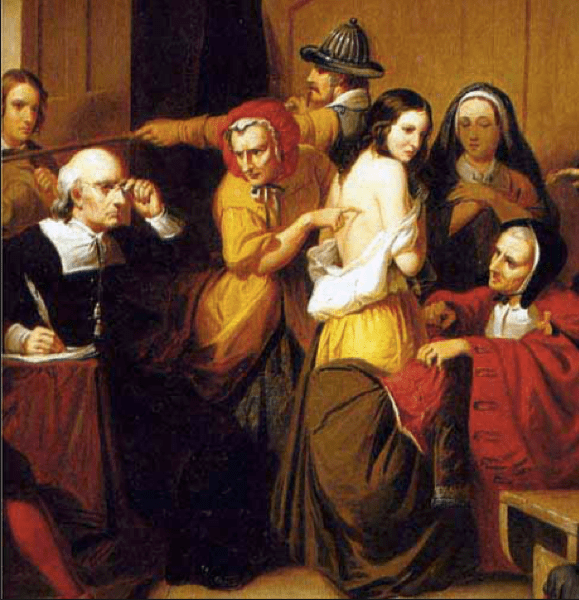
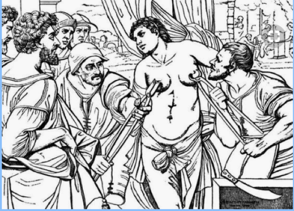

## Welcome! {.center}

# About this course

## Course objectives

 - understand the key concepts in psychological measurement theory
 - build up a comprehensive understanding of specific methods (e.g., Item Response Theory)
 - develop critical thinking regarding measurements in psychology

## Logistics & materials

::: {.fragment}
**Moodle course page**

 - exercises
 - announcements
 - private documents (e.g., articles)
:::

::: {.fragment}
**Course website**

 - slides
:::

::: {.fragment}
**Labs**

 - exercises/labs
:::

::: footer
Content will be updated during the course.
:::

## Grading

- Participation & Exercises 25%
- Final Exam: 75%

# "Advanced Psychological Measurement Theory"

## What is this course about?

"Advanced Psychological Measurement Theory"

- Theory
- Measurement
- Psychological
- Advanced

## How are these topics typically covered?

# Exercise

## {.smaller}

Based on the "What is measurement?" paper (see Documents in Moodle), or any other document, answer the following questions: 

- What are some classic definitions of measurement?

- What do you think of them?

- What are the main keywords/concepts typically covered in measurement theory accounts?

 

::: {.fragment}

Submit your responses in Moodle: assignment: "key concepts and definitions" as 1 PDF file following the convention `<last_name>_definitions.pdf`
:::

::: {.fragment}

You can/should work in groups, but everyone must submit a document (can be the same for all group members). 
:::

::: {.fragment}

Don't use LLMs blindly; think for yourself!
:::

# Use cases

## Use cases {.smaller}

Sometimes theory prevents us from seeing reality.

 

We will see a few examples where measurement plays/played a central role (positively or negatively). 

The goal is to evaluate to what extent the classic psychological measurement theory is adequate and useful in those various scenarios.

##
What do these "stories" tell you about measurement?

# 1. Hysteria

## {.smaller}

<iframe width="1280" height="720" src="https://www.youtube.com/embed/anJKMZCVjxs" frameborder="0" allowfullscreen></iframe>

## Hysteria

see also:

 - [https://www.youtube.com/watch?v=Tz4QmbTDRYs](https://www.youtube.com/watch?v=Tz4QmbTDRYs)
 - [https://www.youtube.com/watch?v=8-CcnAzt0ZI](https://www.youtube.com/watch?v=8-CcnAzt0ZI) 

# 2. Witchcraft
## 

<iframe width="1280" height="720" src="https://www.youtube.com/embed/7x5KesH3dzM" frameborder="0" allowfullscreen></iframe>

## Witchcraft

see also:

 - [Robinson, Daniel (1997) "The Great Ideas of Psychology", Lecture 3:  Minds Possessed—Witchery and the Search for Explanations](https://shop.thegreatcourses.com/the-great-ideas-of-psychology)
 - [https://www.youtube.com/watch?v=rW4XFiHUQAs](https://www.youtube.com/watch?v=rW4XFiHUQAs)

## Witchcraft tests

"Scientific" tests were developed to avoid "unfair" diagnosis.

Definitive Resource: The *Malleus Maleficarum*

 

see [Witch Diagnostics](https://historycollection.com/10-top-historical-tests-proving-someone-witch/)

## 

Swimming test

{fig-align="center" height=500}

## 

Witch Marks

{fig-align="center" height=500}

## 

Pricking Test

{fig-align="center" height=500}

## 

Tear Test

The accused is read a text about the sacrifice of Jesus; if the accused does not form tears by the end of the story, the accused is presumed to be a witch.

## Concerns about validity

"Witchcraft is real, but...

 - perhaps older women are less biologically able to form tears
 - perhaps they float because of their lower bone density
 - ... 

::: {footnote}
Johann Weyer’s *De Prestigiis Daemonum*, 16th century
:::

# 3. Functional Neurological Disorder (FND)

## running, walking

<iframe width="1280" height="720" src="https://www.youtube.com/embed/Y2kwQrhxttU" frameborder="0" allowfullscreen></iframe>

## seizures

<iframe width="1280" height="720" src="https://www.youtube.com/embed/v1C1fPqtDE8" frameborder="0" allowfullscreen></iframe>

## Patient testimony

<iframe width="1280" height="720" src="https://www.youtube.com/embed/LsJ6NvnpGz4" frameborder="0" allowfullscreen></iframe>

## Misdiagnosis

<iframe width="1280" height="720" src="https://www.youtube.com/embed/MPSDi-jBBXA" frameborder="0" allowfullscreen></iframe>

## Neurosymptoms.org

<iframe width="1280" height="720" src="https://neurosymptoms.org/en/" frameborder="0" allowfullscreen></iframe>

<!--
## Homework
Read the FND review on Moodle.
-->

