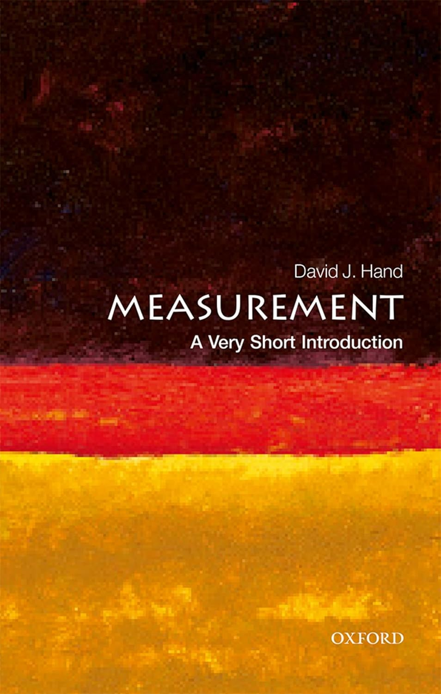
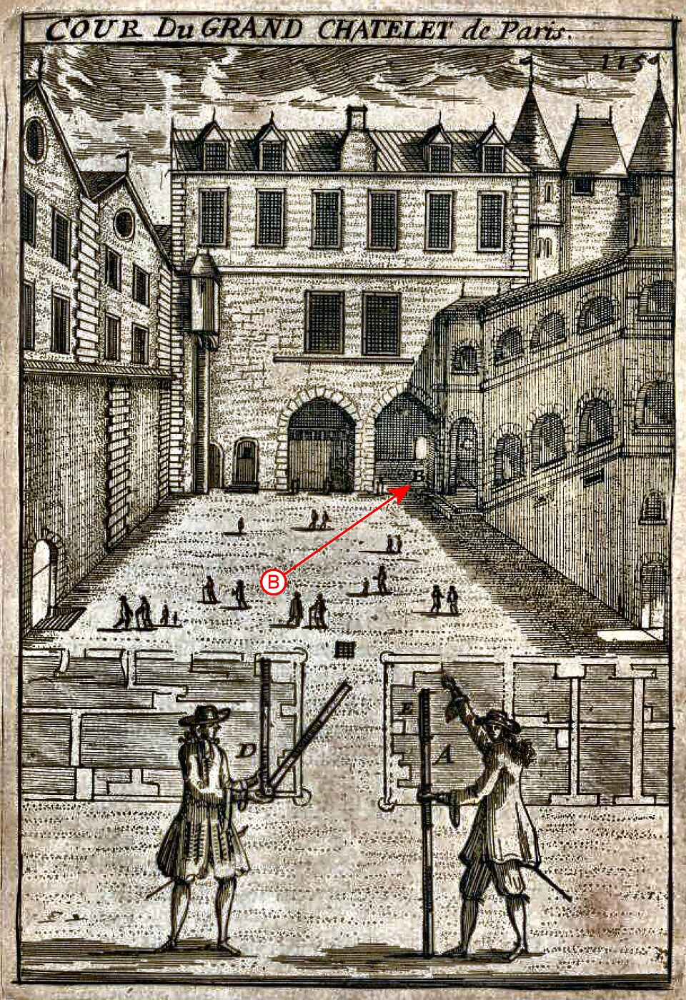
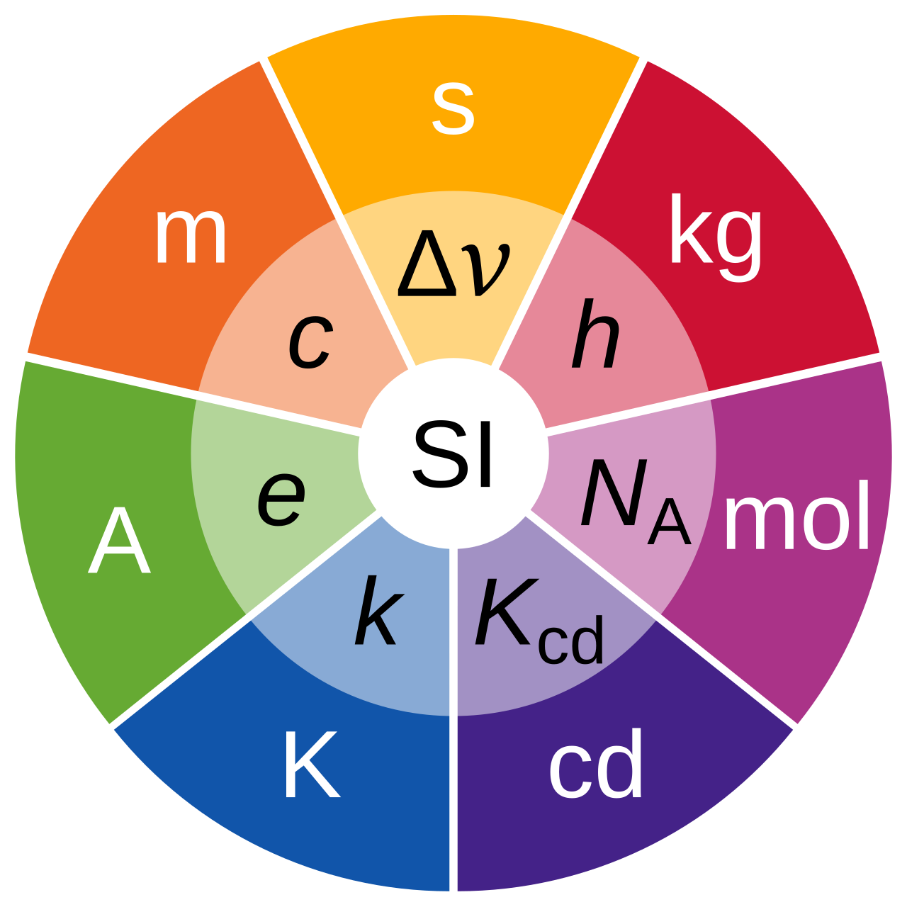

## {.smaller}

:::: {.columns}

::: {.column}
{fig-align="center" height=500}
:::

::: {.column}

[Hand, David J.,](https://en.wikipedia.org/wiki/David_Hand_(statistician)) 

*Measurement: A Very Short Introduction, Very Short Introductions* (Oxford, 2016; online edn, Oxford Academic, 27 Oct. 2016), https://doi.org/10.1093/actrade/9780198779568.001.0001.

:::

::::

## 
Measurement is as old as civilization:

 - agriculture
 - trade / accounting
 - construction
 - navigation

Can you find examples of measurements that are used in each case?

## Exercise {.center}

**Why** do we measure things?

- give examples
- organize examples into categories 

::: {.notes}
ask why multiple times
:::

## Units of Measurement

What references should we pick? 

(For example for length?)

## use of natural objects {.smaller}

natural objects as measurements

- dry grains of weat
- fathom: height of a man (~ 182.88 cm)
- cubit: length of forearm from elbow to extended fingers (~ 45.72 cm)
- foot: length of a man's foot (~ 30.48 cm)
- ...

human activity

- how much a miner could dig in 1 day
- distance a bow could shoot an arrow
- ...

## Pros and Cons?

## Problems

1. variability of the references

2. arbitrariness of choice of reference

# Problem 1:  How to reduce variability?

## P1: How to reduce variability?

::: {.fragment}
Solution 1: statistics: compute averages 
:::

::: {.fragment}
{fig-align="center" height=500}

Jacob Koebel (1570)
:::

## Do we do this in psychology? {.center}

## P1: How to reduce variability?
::: {.fragment}
Solution 2: use specific objects as references (more stable), make copies and share them.
:::

::: {.fragment}
{fig-align="center" height=400}
:::

::: {.footer}

[https://en.wikipedia.org/wiki/Toise](https://en.wikipedia.org/wiki/Toise)

:::

## Do we do this in psychology? {.center}

## P1: How to reduce variability?
::: {.fragment}
Solution 3: use more fundamental physical objects as references (more stable)
:::

 

::: {.fragment}
1791, French Academy of Science: 

- **1 meter** = distance of North Pole to equator / 10'000'000 
- **1 second** = 1 / 86'400 of a solar day 

:::

## Do we do this in psychology? {.center}

# Problem 2:   Arbitrary choices?

## P2: Arbitrary choices?

:::{.fragment}

 - many systems exist in parallel
 - the same unit could have different names
 - the same name could have different meanings

:::

:::{.fragment}

 This causes many challenges:

 - hard to use & understand
 - challenges for communication & interoperability
 - higher error rates

:::

## Complexity

[wikipedia: Traditional French units of measurement](https://en.wikipedia.org/wiki/Traditional_French_units_of_measurement)

## Polysemy, Homonymy

This is still the case today!

- "a pint of beer..."

- US pint < UK pint

- 473 ml < 569 ml

## Do we have these problems in psychology? {.center}

## P2: Arbitrary choices?

How can we fix this?

## P2: How to reduce arbitrariness?

... or rather complexity

::: {.fragment}
Solution: enforce a single unified system 
:::

::: {.fragment}

- benefits are clear and consensual
- but hard to change habits and adopt new standards

:::

## Systeme International d'Unités (SI units)

[1960: 11th General conference on Weight and Measure](https://en.wikipedia.org/wiki/General_Conference_on_Weights_and_Measures)

:::: {.columns}

::: {.column}

{fig-align="center" height=400}

:::

::: {.column}
- 7 [SI base Units](https://en.wikipedia.org/wiki/International_System_of_Units)
- 22 named units
- and more...

:::

::::

::: {.footer}

[https://en.wikipedia.org/wiki/International_System_of_Units](https://en.wikipedia.org/wiki/International_System_of_Units)
:::

## Exercise

- Have a look at the units of joule. Does it surprise you?

# Questions

## What properties do you want your reference to have? {.center}
(aka what units should you pick?)

## Did we really reduce arbitrariness? {.center}

- Can we do it?
- Does it matter?

# How big is planet Earth?

## How could you measure the size of Earth? {.center}

## 
<!--How large is Earth?-->

<iframe width="1280" height="600" src="https://www.youtube.com/embed/EfZ2HZH5CkA" frameborder="0" allowfullscreen></iframe>

##

More detailed explanation:

<iframe width="1280" height="600" src="https://www.youtube.com/embed/14d-GonvB9A" frameborder="0" allowfullscreen></iframe>

## Did Eratosthenes really measure the size of Earth? {.center}

::: {.notes}

- how can we confirm his estimate is true?
- he did not measure but infer
- yet the underlying dimension is still "length"

:::

# Co-Evolution

## Co-evolution of science, technology, culture and measurement accuracy

- rough measures are initially OK;
- but as science, technology, and culture advances, more accurate measurements become necessary. 

::: {.fragment}
**Examples:**

- navigation 
- industrial revolution
- discovery of [Pluto](https://en.wikipedia.org/wiki/Pluto) based on measured perturbations of the orbit of Uranus
:::

## 

<!--Numeric systems: 5 minutes-->

<iframe width="1280" height="600" src="https://www.youtube.com/embed/cZH0YnFpjwU" frameborder="0" allowfullscreen></iframe>

# Use cases
What key measurement concepts are being introduced in these video?

## 
<!--Surveying Land in the 1800's: 9 minutes -->

<iframe width="1280" height="600" src="https://www.youtube.com/embed/t6xA7-h8ZLg" frameborder="0" allowfullscreen></iframe>

## 
<!-- A brief history of (keeping) Time: 6 minutes -->

<iframe width="1280" height="600" src="https://www.youtube.com/embed/mjSwRwAqQA4" frameborder="0" allowfullscreen></iframe>

