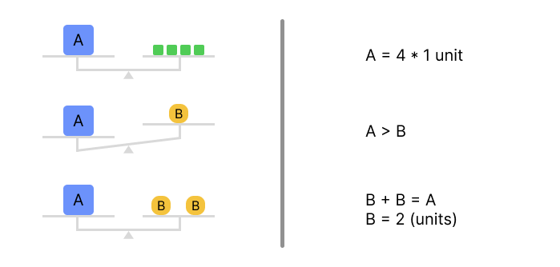
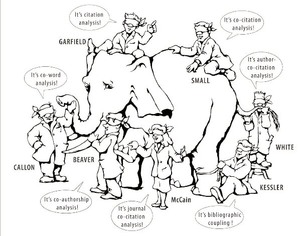
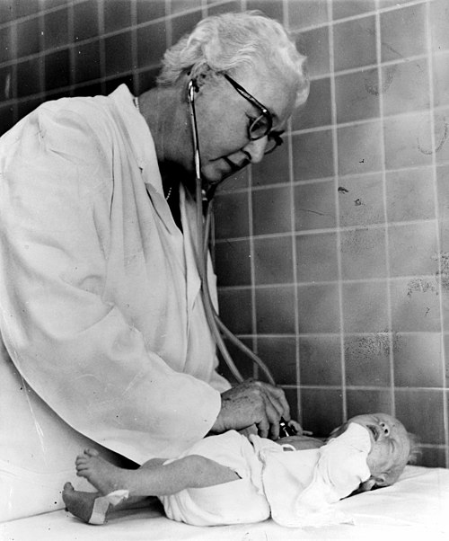
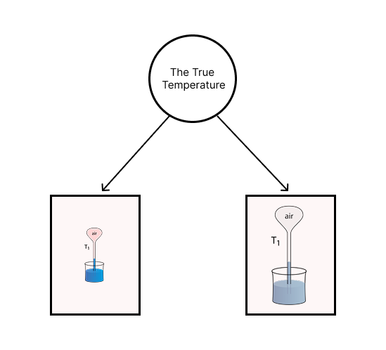

## Different types of measurement?

- Are measurements in physics and in psychology different?
- If so, how?

## {.center}

The position that measurements in psychology and physics are qualitatively different is very common:

>  "The difficulty with measurement in the psycho-social world is that the attributes of interest are generally not directly visible to us as objects of the physical world are. It is only through observable indicator variables of the attributes that measurements can be made. For example, currently there is no machine that can directly measure depression." (p1)

 

::: {.footer}
M. Wu et al. (2016),  
Chapter 1: What is Measurement? 
Educational Measurement for Applied Researchers, 
[DOI 10.1007/978-981-10-3302-5_1](https://link.springer.com/book/10.1007/978-981-10-3302-5)
:::

## {.smaller}

:::: {.columns}

::: {.column}
{fig-align="center" height=500}
:::

::: {.column}

[Hand, David J.,](https://en.wikipedia.org/wiki/David_Hand_(statistician)) 

*Measurement: A Very Short Introduction, Very Short Introductions* (Oxford, 2016; online edn, Oxford Academic, 27 Oct. 2016), https://doi.org/10.1093/actrade/9780198779568.001.0001.

:::

::::

# Representational vs Pragmatic Measurements {.smaller}

## {.center}

::: {.columns}

:::: {.column}
**Representational**

 - length
 - weight
 - ...

::::

:::: {.column}
**Pragmatic**

- cost of living
- Apgar score
- ...

::::

:::

::: {.footer}
the two extremes of a continuum
:::

## {.center}

**Representational measurement**

- We assign numbers (using a specific procedure) to different objects, *so that* the relationships between numbers correspond to the relationship between the objects.

- They reflect a property of the world, which exists and is defined independently of the specific measurement procedure. 

## {.center}

{fig-align="center" height=400}

## Does this make sense? {.center}

## {.center}

**Pragmatic measurement**

- We design / construct a measure (with desirable properties) for a specific purpose.

- The pragmatic measurements "simultaneously defines the attribute being measured and specifies how to measure it". 

## Exercise: {.center}

- Create a measure of the "cost of living in Luxembourg".

## {.center}

- each suggestion will likely be slightly different
- none is wrong or correct
- what exactly it measures is defined by how exactly that measure is constructed

## Aggregation of scores

- Some measures are given by a single number (e.g., "weight"); 

- Others are computed by aggregating (e.g., summing) multiple numbers into one score (e.g., "cost of living")

## {.center}

**The conceptual question:**

:::: {.columns}

::: {.column .fragment}

{fig-align="center" height=400}

:::

::: {.column .fragment}

{fig-align="center" height=400}

:::

::::

## 

**The methodological question:**

How exactly should we "aggregate" numbers into scores?

- summing?
- averaging?
- model fit?
- weighting or not?
- optimize for specific purpose?

## Exercise: {.center}

Find examples in psychology of different ways of aggregating numbers into a score.

<!--

(e.g., a questionnaire or other measurement instrument).

How do they aggregate numbers into scores?

 - [Beck Depression Inventory](https://www.ismanet.org/doctoryourspirit/pdfs/Beck-Depression-Inventory-BDI.pdf)
 - [Perth Alexithymia Questionnaire (PAQ)](https://www.researchgate.net/publication/325345117_Perth_Alexithymia_Questionnaire_PAQ_Copy_of_questionnaire_and_scoring_instructions)
 - [General Anxiety Disorder](https://www.dartmouth-hitchcock.org/sites/default/files/2021-02/gad-7-anxiety-scale.pdf)

-->

## {.center}

- Questionnaires (e.g., GAD-7)
- Cognitive tests (e.g., fluid intelligence)
- Educational assessments (e.g., grades)

## Mixtures of measurement types
[The Apgar Score](https://en.wikipedia.org/wiki/Apgar_score)

{fig-align="center" height=500}

# Measurements in physics, not that different? {.center .smaller}

##
<!--
(a short history of measuring temperature)
-->
<iframe width="1280" height="720" src="https://www.youtube.com/embed/rARnTlPax8E" frameborder="0" allowfullscreen></iframe>

## ~2000 years of progress in measuring temperature

- The [Thermo**scope**](https://en.wikipedia.org/wiki/Thermoscope)
- The [Thermo**meter**](https://en.wikipedia.org/wiki/Thermometer)
- The [Kelvin base unit](https://en.wikipedia.org/wiki/Kelvin)
- Controlling confounding variables
- The triangulation of methods
- Theory development: 
    - conceptual clarity
    - consistency
    - predictive power

## Steven's taxonomy of measurement levels

[Measurement levels](https://en.wikipedia.org/wiki/Level_of_measurement): (N-O-I-R)

- what are admissible transformations? 

- what are equivalent instruments?

- what types of data analysis are legit?

<!--
Stevens’ taxonomy of scale levels (Stevens, 1946, 1958), which is purely defined by admissible transformations in the number space.
-->

<!--
## 
Veritassium animation
<iframe width="1280" height="500" src="https://www.youtube.com/embed/LgrXd0NM2y8" frameborder="0" allowfullscreen></iframe>

-->

## 

Permissible transformations & measurement levels: 

- Can we create a language that is "equivalent" to Luxembourgish?
- Is a °C thermometer equivalent to a °F thermometer?
- is a °C thermometer equivalent to a thermoscope?

##  Permissible transformations & Measurement scales

{fig-align="center" height=500}

## Caution: {.center}

It's easy to make the *mistake* of assigning numeric properties to reality when using numbers to represent measurements!

## Does this actually matter? {.center}

## {.center}

A.P. Pedersen, D. Kellen, C. Mayo-Wilson, C.P. Davis-Stober, J.C. Dunn, M.A. Khan, M.B. Stinchcombe, M.L. Kalish, K. Tentori, & J. Haaf, **Discourse on measurement**, *Proc. Natl. Acad. Sci. U.S.A.* 122 (5) e2401229121, [https://doi.org/10.1073/pnas.2401229121](https://doi.org/10.1073/pnas.2401229121) (2025).

## {.center}

- exposure to “lead is responsible for the loss of 824,097,690 IQ points as of 2015” (1), 

- cash recipients in “lower-income countries gained three times more happiness than those in higher-income countries” (2), 

- humans choose “numerical answers in a systematic way as though they sense within themselves--and can communicate--a reliable numerical scale for their feelings” (3).

::: {.footer}

1. M. J. McFarland, M. E. Hauer, A. Reuben, Half of us population exposed to adverse lead levels in early childhood. Proc. Natl. Acad. Sci. U.S.A. 119, e2118631119 (2022). 

2. R. J. Dwyer, E. W. Dunn, Wealth redistribution promotes happiness. Proc. Natl. Acad. Sci. U.S.A. 119, e2211123119 (2022). 

3. C. Kaiser, A. J. Oswald, The scientific value of numerical measures of human feelings. Proc. Natl. Acad. Sci. U.S.A. 119, e2210412119 (2022).

:::

# Homework

## 
Read: 
 

Bringmann, L. F., & Eronen, M. I. (2016). Heating up the measurement debate: What psychologists can learn from the history of physics. *Theory & Psychology*, 26(1), 27-43.

 
Answer:
- What are the 3 main points made by Bringmann & Eronen (2016)?
- List and briefly explain the three points. 
- Do you agree with them?

##

Some key ideas:

- development of tools without theory
- theory development despite bad measures
- triangulation of methods
- "miraculous" correct predictions

