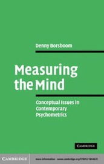
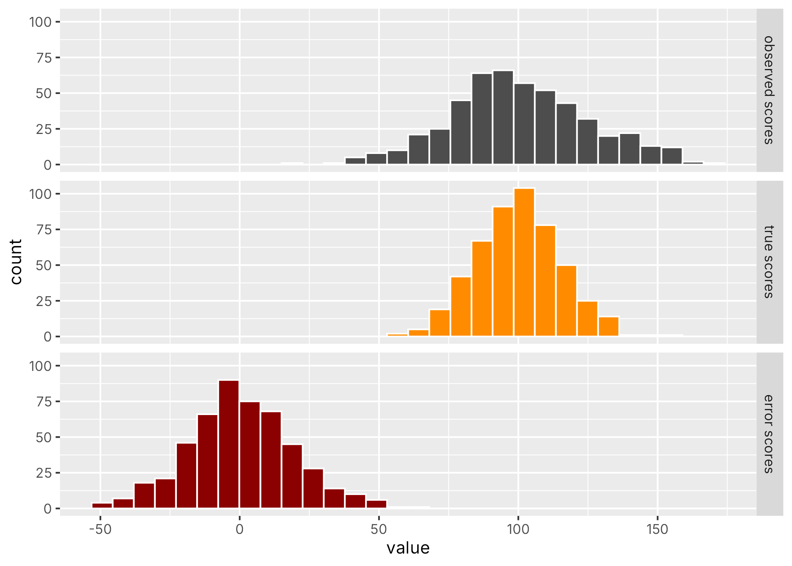

## Recap

We listed several approaches to determine the reliability of a thermometer. 

The same approaches did not seem to work well for questionnaire data.


## Classical Test Theory (CTT) {.center}

In psychometrics, "reliability" is most often associated to "Classic Test Theory" (aka "True Score Theory").


##

> "[Lord and Novick (1968)'s] treatment of the classical test model [...] is arguably the most influential treatise on psychological measurement in the history of psychology."

::: {.fragment}

> [...] few psychologists know about the other approaches [...] but every psychologist knows about true scores, random error, and reliability — the core concepts of classical test theory" (p11)

:::


::: {.footer}

Borsboom D. Measuring the Mind: Conceptual Issues in Contemporary Psychometrics. Cambridge University Press; 2005.

:::


## What people say about it. {.smaller}

CTT is still relevant today: 

::: {.fragment}

> "The fact that CTT was developed before IRT does not mean that CTT is outdated or replaced by IRT. Both CTT and IRT provide useful statistics to help us analyze data. [...] For many item analyses, CTT may be sufficient to provide the information we need."

:::

::: {.fragment}

> "[...] we stress that CTT is an important part of the methodologies for educational and psychological measurement. In particular, the exposition of the concept of reliability in CTT sets the basis for evaluating measuring instruments."

:::

::: {.footer}

Wu et al. (2016) Educational Measurement for Applied Researchers, Chapter 5: Classic Test Theory

:::


## What people say about it. {.smaller}

CTT is fundamentally flawed:

::: {.fragment}

> "In the context of psychological measurement, the stated assumptions are unrealistic [...]" (p16)

:::

::: {.fragment}

> "Basically, the classical test theorist is trying to sell you shoes which are obviously three sizes too small." (p20)

:::

::: {.fragment}

> "[...] 95 per cent of researchers involved in research in differential psychology are probably not doing what they think they are doing. For no concept in test theory has been so prone to misinterpretation as the true score." (p31)

:::

::: {.fragment}

> "[...] the platonic true score interpretation is like an alien in a B-movie: no matter how hard you beat it up, it keeps coming back." (p32)

:::

::: {.footer}

Borsboom D. Measuring the Mind: Conceptual Issues in Contemporary Psychometrics. Cambridge University Press; 2005.

:::

## {.center}

[Measuring the Mind](https://www.cambridge.org/core/books/measuring-the-mind/1DB84F33B196C4F2658209B7BC8806E1)


{fig-align="center" height=400}


::: {.footer}

Borsboom D. Measuring the Mind: Conceptual Issues in Contemporary Psychometrics. Cambridge University Press; 2005.

:::


## What do you think? {.center}

- What is CTT?
- What are its main criticisms?


# Classical Test Theory (CTT) {.center}

## Goal

Our main goal is to determine the reliability of our questionnaire. 

To do so we will go through some "theoretical acrobatics" (p31)


::: {.footer}

Borsboom D. Measuring the Mind: Conceptual Issues in Contemporary Psychometrics. Cambridge University Press; 2005.

:::


## core idea #1

::: {.fragment}

CTT defines the **true score** of person $i$, $t_i$ as the expectation of the observed score $X_i$ over replications:

$$ t_i \equiv \mathbb{E}[X_i]$$

:::


::: {.fragment}
We can never observe $t_i$!
:::


## core idea #2

::: {.fragment}

CTT defines the **error score** $E_i$ as the difference between the observed score and the true score:

$$E_i \equiv X_i - t_i $$

:::


<br>

::: {.fragment}
Note: $X_i$ and $E_i$ are random variables, $t_i$ is by definition a constant.
:::

## core idea #3 (main equation)


::: {.fragment}

When testing multiple people, an extra source of randomness is introduced by sampling from a population.

$$X = T + E$$

<br>

(i.e., true score is now also a random variable)

:::


## In words... {.center}

Each person $i$ has an observed score $x_i$. CTT states that this $x_i$ can be broken down into $t_i$ which is that person's true score, and $e_i$ the measurement error which explains why the observed score does not perfectly match the true score. 


## {.center}
That same person *could have* responded somewhat differently on that test: 
in that case the value of $e_i$ would be different and the value of $x_i$ would also be different, but the value of $t_i$ would be the same.

<br>

::: {.fragment}
(i.e., $X_i$ and $E_i$ are viewed as random variables and $x_i$ and $e_i$ are specific realisations of those RVs).
:::


## {.center}

By CTT **definition**, if we were to compute the average across replications of the test score, we would get an estimate of the person's true score.

<br>
Defining $t_i \equiv \mathbb{E}[X_i]$ *necessarily* implies $\mathbb{E}[E_i]=0$

## {.center}

By CTT **definition**, the true scores and the error scores are independent from each other (i.e., no correlation)


## Do these assumptions make sense? {.center}

- the true score is unknown
- what does "could have" mean?
- setting true score to be equal to the expectation of the test score is problematic (e.g., assumes no bias)
- true score definition is inherently tied to a specific test


## Reliability {.center}

Given $X = T + E$, 

how would you define reliability?


## Reliability {.center}

... the fraction of the observed variance $\sigma^2_X$ that is due to variation in true scores $\sigma^2_T$ as opposed to random error $\sigma^2_E$


## {.center}

Given that $T$ and $E$ are independent (by definition),  

$$\sigma^2_X = \sigma^2_T + \sigma^2_E$$


::: {.fragment}
We can define reliability as


$$
\rho^2_{XT} = \frac{\sigma^2_T}{\sigma^2_X} = \frac{\sigma^2_T}{\sigma^2_T + \sigma^2_E} 
$$

::: 


<!-- 


## {.center}

**Reliability** is the proportion of observed variance that is due to true score variance:

$$\rho_{XX'} = \frac{\sigma^2_T}{\sigma^2_X} = \frac{\sigma^2_T}{\sigma^2_T + \sigma^2_E}$$

::: {.fragment}
- Ranges from 0 (all error) to 1 (no error)
- Also interpretable as the squared correlation between observed and true scores
:::


-->


## Computer simulations {.center}


```r
set.seed(42)

# true score parameters
m <- 100 #  mean of true score in the population
s <- 15  # standard deviation of true score in the population

# error score parameters
s_err <- 20

# simulating data
n <- 500
true_scores <- rnorm(n, m, s)
error_scores <- rnorm(n, 0, s_err)
observed_scores <- true_scores + error_scores
```

##

{fig-align="center" height=500}


## Exercise {.center}

Calculate the reliability 

(measuring-the-mind-labs on github)


## Reliability depends on the population tested!

Intuition:

:::: {.columns}

::: {.column}
**Low reliability** $\rho \approx 0$

Most variance is noise — the instrument is unstable
:::

::: {.column .fragment}
**High reliability** $\rho \approx 1$

Most variance reflects real differences between people
:::

::::

::: {.fragment}

> Reliability tells us how much we can *trust* that differences in scores reflect real differences in the underlying attribute.

> It is not the variance of the error!

:::


##  {.center}

Are we done?

Can we do this in practice?


## {.center}

In practice, we obviously don't know the true scores, so we can't compute $\sigma^2_T$ and thus we can't use that equation for computing reliability. 

::: {.fragment}
How do we get out of this impasse?
:::


## Parallel tests!

Assume that people complete the same test twice<br>
(with "brainwashing").

$$x_i^{(1)} = t_i + e_i^{(1)}$$

$$x_i^{(2)} = t_i + e_i^{(2)}$$


we assume also that $cov(E^{(1)}, E^{(2)}) = 0$

Intuitively, the correlation between $X^{(1)}$ and  $X^{(2)}$ tells us something about reliability.


## 

**Reliability defined as correlation between parallel tests**


::: {.fragment}

[changing notation for consistency:]{style="font-size:0.5em"}
$$\rho_{XX'} = \rho_{X^{(1)}X^{(2)}}$$

:::


::: {.fragment}

[applying the correlation formula:]{style="font-size:0.5em"}
$$
\rho_{XX'} = \frac{cov(XX')}{\sigma_{X} \sigma_{X'}}
$$
:::


::: {.fragment}
[based on CTT assumptions:]{style="font-size:0.5em"}

$$
\rho_{XX'} = \frac{cov(XX')}{\sigma_{X} \sigma_{X'}} = \frac{\sigma^2_T}{\sigma^2_X}
$$

:::


## {.center}

$$
\rho_{XX'} = \rho_{XT}^2  =  \frac{\sigma^2_T}{\sigma^2_X}
$$


##

Recall our little experiment: 

 > How tired are you now? On a scale from 1 (fully awake) to 10 (almost asleep)


##

| Q1 | Q2 | Q3 |
|----|----|----|
| 5  | 5  | 5  |
| 4  | 4  | 5  |
| 2  | 2  | 4  |
| 5  | 5  | 6  |
| 7  | 5  | 5  |
| 7  | 7  | 7  |
| 7  | 6  | 8  |
| 6  | 6  | 7  |
| 7  | 7  | 8  |
| 4  | 4  | 4  |
| 3  | 3  | 4  |


## {.center}

Can we consider these 3 completions of the test as being "equivalent"?

## {.center}

What does "error" mean in this context?

## Exercise {.center}

Compute the reliability on this dataset (see notebook)


# Estimating Reliability {.center}


## Four main approaches {.center}

1. Test-retest reliability
2. Parallel forms reliability
3. Internal consistency
4. Inter-rater reliability


## 1. Test-retest reliability {.center}

Administer the **same instrument twice** to the same people, separated by a time interval.

$$r_{tt} = \text{cor}(X_{\text{time 1}},\ X_{\text{time 2}})$$

::: {.fragment}
**Problem:** how long to wait?

- Too short → carry-over effects (memory)
- Too long → true change in the attribute
:::


## 2. Parallel forms reliability {.center}

Create **two equivalent versions** of the instrument and administer both to the same people.

::: {.fragment}
Parallel forms must satisfy:

- Equal true score means: $\mathbb{E}[X_1] = \mathbb{E}[X_2]$
- Equal error variances: $\sigma^2_{E_1} = \sigma^2_{E_2}$
:::

::: {.fragment}
**Problem:** constructing truly parallel forms is difficult in practice.
:::


## 3. Internal consistency {.center}

Estimate reliability from a **single administration** using the covariance structure among items.

::: {.fragment}
The key idea: if items measure the same construct, they should **correlate with each other**.
:::


## Split-half reliability {.smaller .center}

Split the test into two halves (e.g., odd vs. even items) and correlate their scores.

$$r_{\text{split-half}} = \text{cor}(X_{\text{half 1}},\ X_{\text{half 2}})$$

::: {.fragment}
Apply the **Spearman-Brown correction** to estimate full-test reliability:

$$r_{SB} = \frac{2\, r_{\text{split-half}}}{1 + r_{\text{split-half}}}$$
:::

::: {.fragment}
**Problem:** the result depends on *how* you split the test.
:::


## Cronbach's $\alpha$ {.center}

Cronbach's $\alpha$ generalises split-half reliability by averaging over **all possible split-halves**:

$$\alpha = \frac{k}{k-1} \left(1 - \frac{\sum_{i=1}^{k} \sigma^2_{Y_i}}{\sigma^2_X}\right)$$

::: {.fragment}
- $k$ = number of items
- $\sigma^2_{Y_i}$ = variance of item $i$
- $\sigma^2_X$ = variance of the total score
:::

::: {.fragment}
$\alpha$ is a **lower bound** on reliability — it equals reliability only when the $\tau$-equivalence assumption holds.
:::


## Interpreting $\alpha$ {.center}

Common (rough) guidelines:

| $\alpha$ | Interpretation |
|---|---|
| $\geq .90$ | Excellent |
| $.80 - .89$ | Good |
| $.70 - .79$ | Acceptable |
| $.60 - .69$ | Questionable |
| $< .60$ | Poor |

::: {.fragment}
> These thresholds are just conventions.
:::


## 4. Inter-rater reliability {.center}

When scores are assigned by human judges, we want to know how **consistently different raters agree**.

::: {.fragment}
Common indices:

- **Percent agreement** (simple but ignores chance)
- **Cohen's $\kappa$** (corrects for chance agreement)
- **Intraclass correlation (ICC)** (for continuous ratings)
:::


# Standard Error of Measurement {.center}


## {.center}

The **Standard Error of Measurement (SEM)** expresses reliability in the **original unit** of the scale:

$$SEM = \sigma_X \sqrt{1 - \rho_{XX'}}$$

::: {.fragment}
- $\sigma_X$ = standard deviation of observed scores
- $\rho_{XX'}$ = reliability coefficient
:::


## {.center}

The SEM defines a **confidence interval** around an observed score:

$$T \in [X \pm z \cdot SEM]$$

::: {.fragment}
**Example:** if a test has $\sigma_X = 15$, $\rho = .91$

$$SEM = 15\sqrt{1 - .91} = 15 \times 0.3 = 4.5$$

A score of 100 → true score likely in [91, 109] (95% CI)
:::

::: {.fragment}
> The SEM helps communicate measurement uncertainty in practical, interpretable terms.
:::


# Reliability vs. Validity {.center}


## {.center}

The notion of validity is ill-defined in CTT: 

By definition the observed score reflects the true score (whatever that is), therefore the test is necessarily valid. 

It's not clear however what the *true score* actually is.


## {.center}

**Practical limitations: **

The true score is (too) tightly coupled to the specific test used. 

- what if someone skips a question? 
- what if we have limited time to ask questions and want to ask only a subset of questions?
- what if we have many questions and we want to ask the questions that are most informative given prior responses (adaptive testing)?


# Exercise {.center}

##  {.center}


> "[...] frequently, we place one or two easy items at the beginning of a test to ease any anxiety on the part of the students."

Is this approach consistent with Classic Test Theory?

::: {.footer}

Wu et al. Chapter 5: Classic Test Theory p87

:::


##  {.center}


Do you think the reliability index as defined by CTT is satisfactory?


If your patient fills out a questionnaire and gets a score of 19, what would you like a reliability index to tell you about this number?


