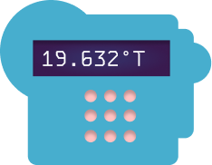

# Mini questionnaire
(pay close attention to your thought process)

Take a sheet of paper...

## {.center}

Question 1:

 

### How tired are you now?

On a scale from 1 (fully awake) to 10 (almost asleep)

## {.center}

Wait a second...

## {.center}

Question 2:

 

::: {.fragment}

### How tired are you now?

On a scale from 1 (fully awake) to 10 (almost asleep)

:::

# Reliability {.center}

Reliability is a key concept in psychological measurement.

::: {.fragment}
- But what does it mean?
:::

::: {.fragment}
- How can you determine if a measurement or instrument is reliable?
:::

# Usecase #1

## {.center}

::: {.columns}

:::: {.column width="40%"}
{fig-align="center" height=200}
::::

:::: {.column width="60%"}

I created this new thermometer and measured the temperature in my office: 

**Is it reliable?**

::::

:::

##

:::: {.columns}

::: {.column}

- Work in groups

- Use post-its (one per idea)

- Answer the following questions:

  - what is reliability? 
  - how can I determine if my thermometer is reliable?

- Propose as many solutions as you can. 

:::

::: {.column}

- ~20 minutes group work
- ~12 minutes to present ideas 
- ~8 minutes discussion

:::

::::

# Usecase #2

## {.center}

::: {.columns}

:::: {.column width="40%"}

{fig-align="center" height=200}

::::

:::: {.column width="60%"}

I created this new anxiety questionnaire and measured the anxiety level of my patient (score is 19). 

**Is it reliable?**

::::

:::

##

:::: {.columns}

::: {.column}

- Work in groups

- Use post-its (one per idea)

- Answer the following questions:

  - what is reliability? 
  - how can I determine if my anxiety questionnaire is reliable?

- Propose as many solutions as you can. 

:::

::: {.column}

- ~20 minutes group work
- ~12 minutes to present ideas 
- ~8 minutes discussion

:::

::::

## 

## {.center}

Question 3:

 

::: {.fragment}

### How tired are you now?

On a scale from 1 (fully awake) to 10 (almost asleep)

:::

## Homework {.center}

- What was it like to answer that same question 3 times? Was it 3 times the same?

- For next time read the 1 page section **Reliability** in Wu et al. (2016) "Chapter 1: What is measurement?"

- Is that definition useful? Does it make sense? 