##  {.center}

10 people completed a Math test that contained 5 items. 

 
**How would you score that test?** 

## case 1 {.center}

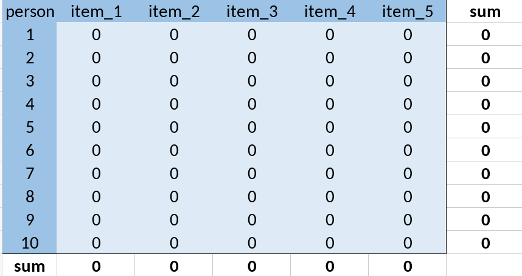{fig-align="left" height=300}

## case 2 {.center}

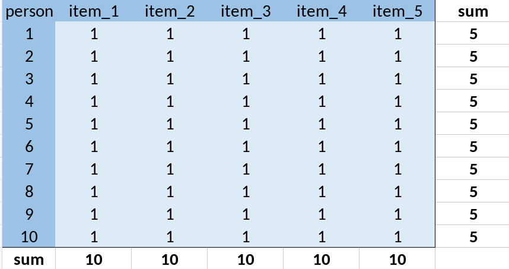{fig-align="left" height=300}

## case 3 {.center}

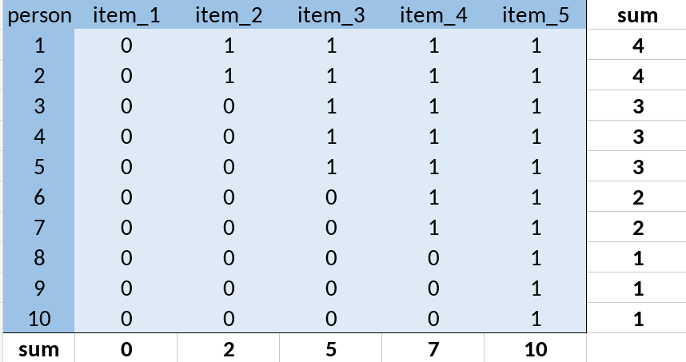{fig-align="left" height=300}

## case 4 {.center}

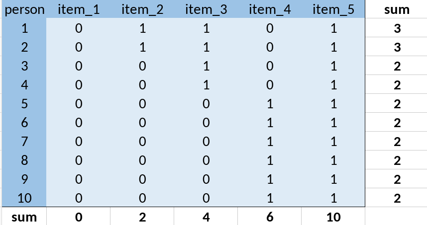{fig-align="left" height=300}

##

::: {.columns}

:::: {.column}
Case 1
{fig-align="left" height=250}

Case 2
{fig-align="left" height=250}

::::

:::: {.column}
Case 3
{fig-align="left" height=250}

Case 4

{fig-align="left" height=250}

::::

:::

## Some key insights

- just adding up may not make sense
- some items/tests are not informative (case 1, 2)
- the scores do not reflect the actual information we have (case 3)
- some items may not behave as expected (case 4)

::: {.notes}
the numbers themselves make no sense:
case 3: if we dropped items 1 and 5 which provide no information, we would have different scores but those differences do not really matter. 
:::

## Recap

CTT decomposes observed scores into a **true score** and **error**:

$$X = T + E$$

::: {.fragment}
The true score is defined as the *expectation* of the observed score — it is intrinsically tied to a specific test.
:::

## Limitations of CTT {.center}

- The true score has no independent meaning outside the test
- What if someone skips a question?
- What if we want to give different people different sets of items?
- What if we want to adapt which items are asked based on prior responses?

::: {.fragment}
These are not mere inconveniences — they reveal a deeper problem about *what CTT is actually measuring*.
:::

## {.center}

CTT does not adequately represent attributes!

::: {.fragment}

Its operationalist view is too restrictive.

:::

## {.center}

Latent variable theory provides a more principled way to extract information from situations like this.

## IRT model {.center}

:::: {.columns}

::: {.column}
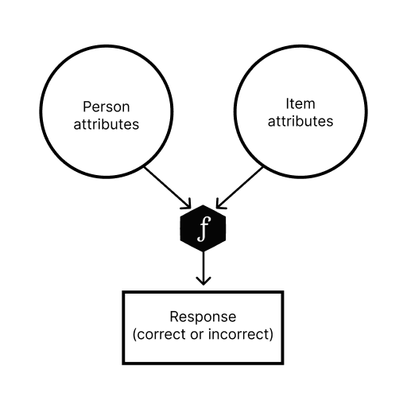{fig-align="left" height=350}

:::

::: {.column}

- person attributes (e.g., math ability)
- item attributes (e.g., difficulty, discriminability)
- logit function

:::

::::

## IRT model {.center}

:::: {.columns}

::: {.column}
{fig-align="left" height=350}

:::

::: {.column}

 - generative model: from the model we can generate data
 - learning from data: from the data we can estimate parameters

:::

::::

## {.center}

- We can learn about a person's attributes because they complete many items. 
- We can learn about an item because they were completed by many people.
- We can learn about both at the same time.
- The more data we have, the more accurate our parameter estimates. 

## IRT model, more formally {.center}

:::: {.columns}

::: {.column}
{fig-align="left" height=350}

:::

::: {.column}

We have many choices:

- how many person attributes?
- how many item attributes?
- how do we link them together (to predict response)? 

:::

::::

## The simplest model: Rasch

::: {.fragment}
One person parameter: ability $\theta_i$
:::

::: {.fragment}
One item parameter: difficulty $\beta_j$
:::

::: {.fragment}

$$P(U_{ij}=1) = \frac{1}{1 + e^{-(\theta_i - \beta_j)}}$$

:::

## {.center}

::: {style="text-align: center;"}
Item Characteristic Curve (ICC)

:::

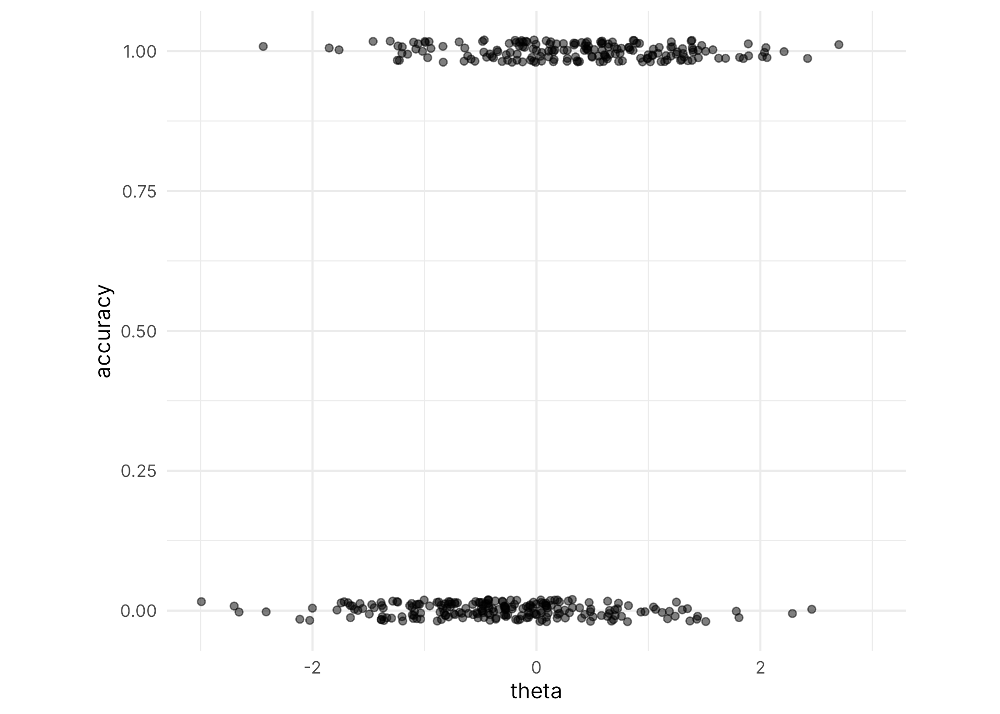{fig-align="center" height=350}

## {.center}

::: {style="text-align: center;"}
Item Characteristic Curve (ICC)
:::

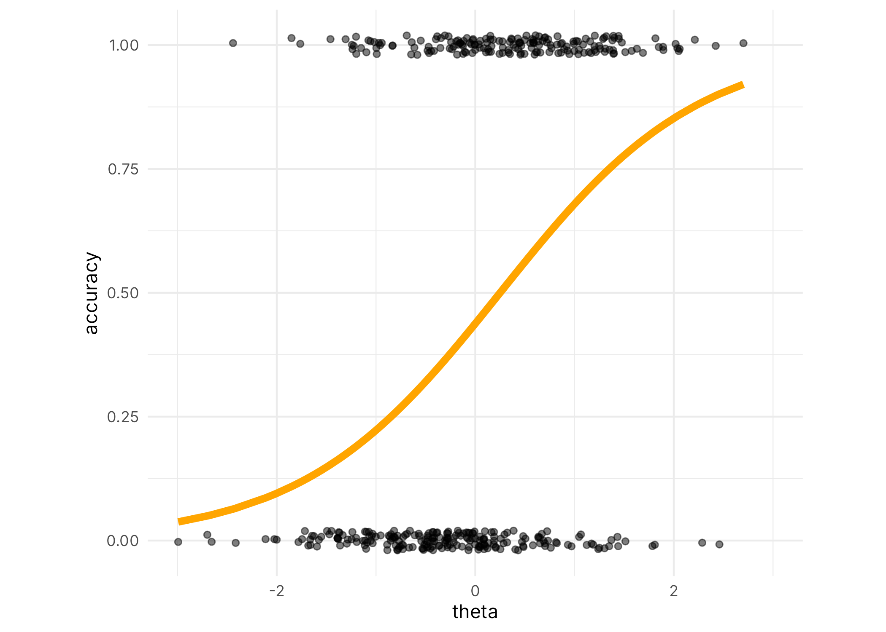{fig-align="center" height=350}

## {.center}

::: {style="text-align: center;"}
Item Characteristic Curve (ICC)
:::

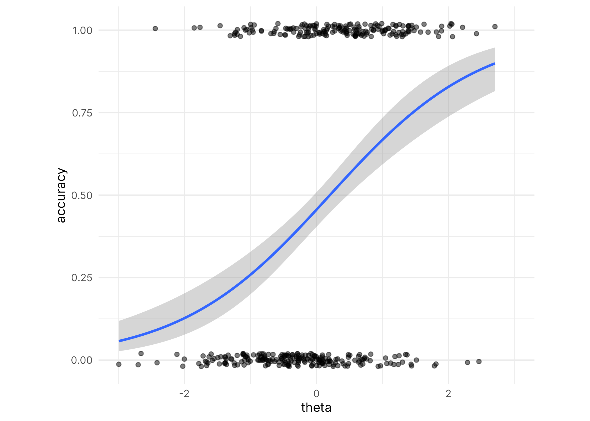{fig-align="center" height=350}

## {.center}

::: {style="text-align: center;"}
Item Characteristic Curve (ICC)
:::

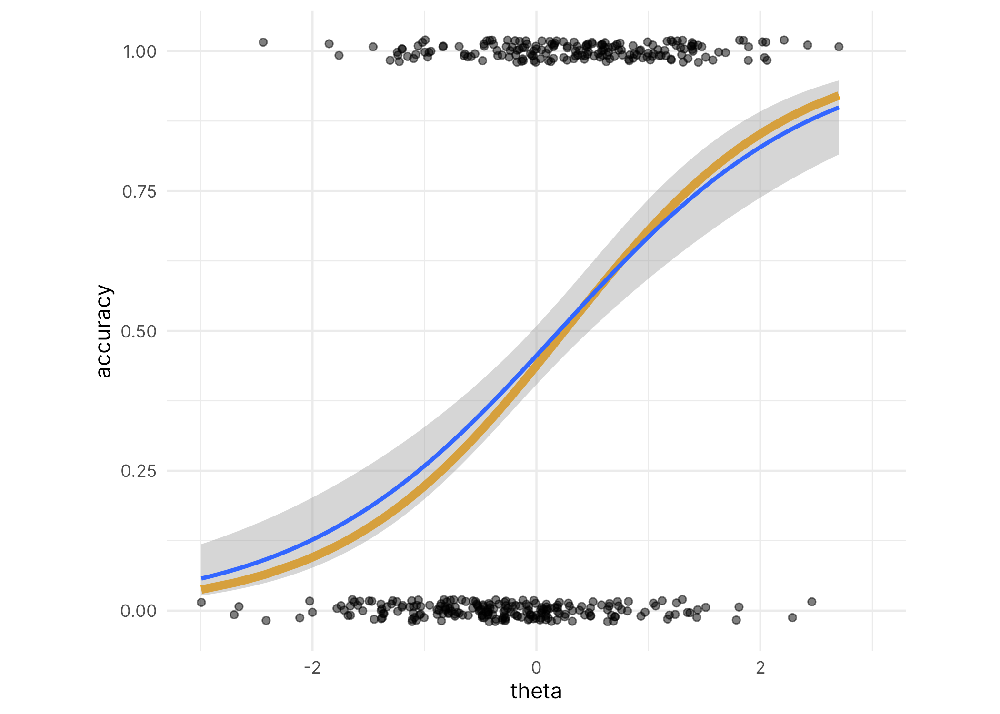{fig-align="center" height=350}

## Other IRT models...
they use more or less parameters to describe *the items*. 

- Rasch model:  $P(U_{ij}=1) = \frac{1}{1 + e^{-(\theta_i - \beta_j)}}$
- 1PL model: $P(U_{ij}=1) = \frac{1}{1 + e^{-\alpha(\theta_i - \beta_j)}}$
- 2PL model: $P(U_{ij}=1) = \frac{1}{1 + e^{-\alpha_j(\theta_i - \beta_j)}}$
- 3PL model: $P(U_{ij}=1) = \gamma_j + (1-\gamma_j) \frac{1}{1 + e^{-\alpha_j(\theta_i - \beta_j)}}$
- ...

::: {.footer}
https://okanbulut.github.io/edpy507/irt.html
:::

## Wright map (Item-Person map)
Do the item difficulties span the range of person abilities in our sample?

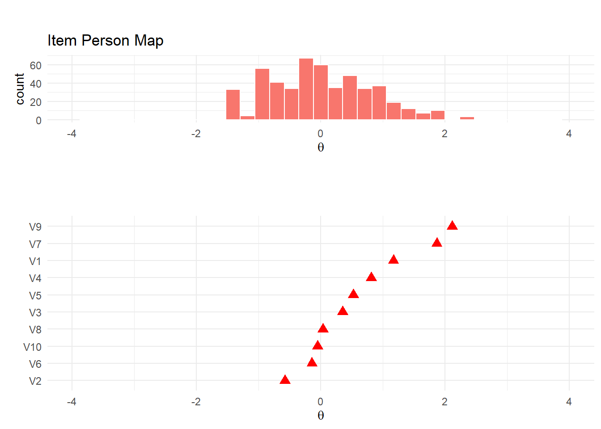{fig-align="center" height=350}

::: {.footer}
[Item Response Theory Practice with R: a Tutorial](https://rstudio-pubs-static.s3.amazonaws.com/1205432_fcbc7d2423324f9aa7709808d4324a90.html)

:::

## Item Information Curves

How much information does an item provide?

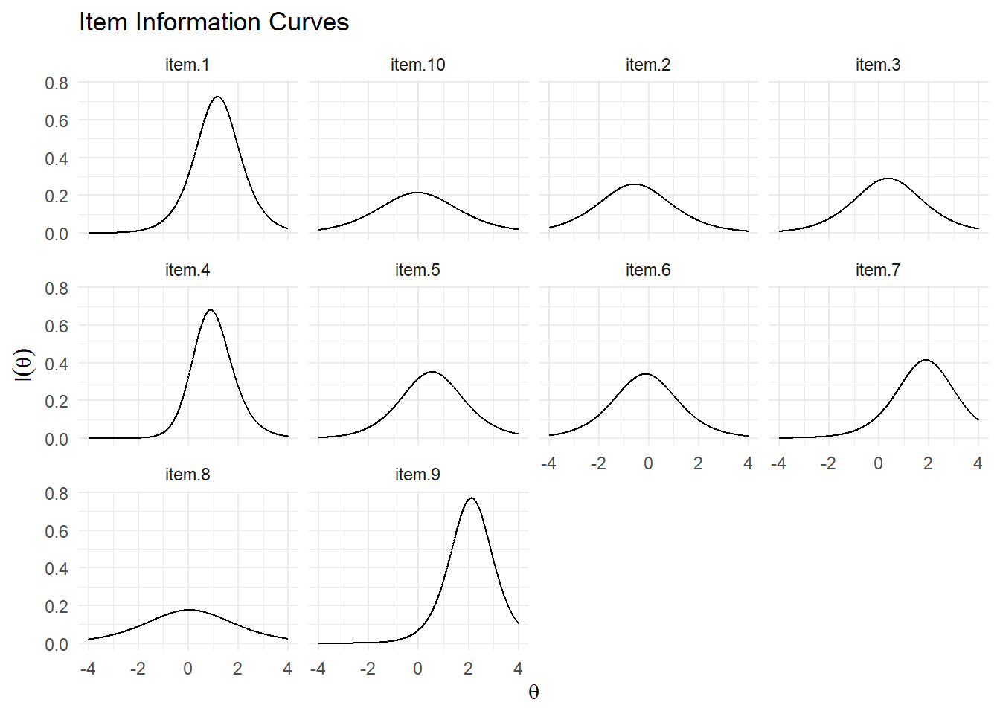{fig-align="center" height=350}

::: {.footer}
[Item Response Theory Practice with R: a Tutorial](https://rstudio-pubs-static.s3.amazonaws.com/1205432_fcbc7d2423324f9aa7709808d4324a90.html)

:::

## Homework {.center}

[Item Response Theory Practice with R: a Tutorial](https://rstudio-pubs-static.s3.amazonaws.com/1205432_fcbc7d2423324f9aa7709808d4324a90.html)

Read that tutorial; 

try to run it on your own machine.

## Homework {.smaller}

Compare this notation: 

- Rasch model:  $P(U_{ij}=1) = \frac{1}{1 + e^{-(\theta_i - \beta_j)}}$
- 1PL model: $P(U_{ij}=1) = \frac{1}{1 + e^{-\alpha(\theta_i - \beta_j)}}$
- 2PL model: $P(U_{ij}=1) = \frac{1}{1 + e^{-\alpha_j(\theta_i - \beta_j)}}$
- 3PL model: $P(U_{ij}=1) = \gamma_j + (1-\gamma_j) \frac{1}{1 + e^{-\alpha_j(\theta_i - \beta_j)}}$

::: {.fragment}
to this one: [https://okanbulut.github.io/edpy507/irt.html](https://okanbulut.github.io/edpy507/irt.html)

- how are the notations different?
- what does each parameter mean?

:::
