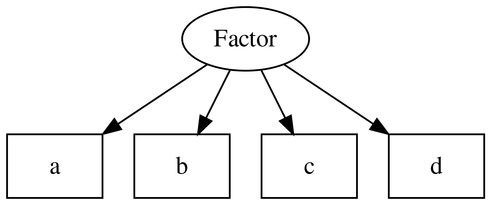

## Recap

CTT decomposes observed scores into a **true score** and **error**:

$$X = T + E$$

::: {.fragment}
The true score is defined as the *expectation* of the observed score — it is intrinsically tied to a specific test.
:::

## Limitations of CTT {.center}

- The true score has no independent meaning outside the test
- What if someone skips a question?
- What if we want to give different people different sets of items?
- What if we want to adapt which items are asked based on prior responses?

::: {.fragment}
These are not mere inconveniences — they reveal a deeper problem about *what CTT is actually measuring*.
:::

## {.center}

CTT does not adequately represent attributes!

::: {.fragment}

Its operationalist view is too restrictive.

:::

# Latent Variable Theory {.center}

## {.center}

[Measuring the Mind](https://www.cambridge.org/core/books/measuring-the-mind/1DB84F33B196C4F2658209B7BC8806E1)

{fig-align="center" height=400}

::: {.footer}

Borsboom D. Measuring the Mind: Conceptual Issues in Contemporary Psychometrics. Cambridge University Press; 2005.

:::

## 

Latent variable theory represents the attribute of interest *explicitly* in the model formulation.

It offers a formal structure that 

- links test scores to hypothesized attributes (i.e., latent variables)
- deduces empirical implications of the model (i.e., conditional independences)
- offers a means to test if a model adequately fits empirical data!

::: {.fragment}

Recall that CTT is unfalsifiable by data.

:::

##

- Latent variable models the data-generating mechanism, in which the attribute is represented explicitly as a latent variable.

- Models can be fit to the data

- It requires making choices to constrain the model; these constraints needs to be justified using theory!

- Models are underdetermined / the data does not speak for itself.

## 
Types of models in this category

- factor analysis (Spearman, 1904)
- confirmatory factor analysis
- item response theory
- latent structure analysis (e.g., latent class analysis)
- ...

## A unified framework:  "Generalized linear item response theory" (GLIRT)

Mellenbergh, G. J. (1994). Generalized linear item response theory. Psychological Bulletin, 115(2), 300–307. [https://doi.org/10.1037/0033-2909.115.2.300](https://doi.org/10.1037/0033-2909.115.2.300)

##

::: {.footer}
[https://benwhalley.github.io/just-enough-r/cfa.html](https://benwhalley.github.io/just-enough-r/cfa.html)
:::

<! --

## Open questions

What do the arrows mean?
 - causality? 

What is the meaning of the latent variable? 

What ontological status do latent variables have?
 - real vs useful fiction?

-->

## 3 key questions

- **syntax:** how do we relate the observed responses to latent variables?
- **semantics:** how do we interpret the "expected response" to an item?
- **ontology:** what type of things are the latent variables and relationships in the model? 

::: {.footer}

Borsboom D. Measuring the Mind: Conceptual Issues in Contemporary Psychometrics. Cambridge University Press; 2005.

:::

## Syntax: a general form

$$g[\mathbb{E}(U_{ij})] = \beta_j +  \alpha_j * \theta_i$$

- $g()$ := link function
- $\mathbb{E}(U_{ij})$ := expected response of person $i$ to item $j$
- $\theta_i$ := parameter(s) about the person $i$
- $\beta_j$, $\alpha_j$:= parameters about the item $j$

::: {.fragment}

There are many variants of this!

:::

## many variants...

for combinations of 

 - type of observed variable (e.g., continuous, categorical)
 - type of latent variables (e.g., continuous, categorical)
 - the link function used (e.g., identity, logit)

::: {.fragment}
Example:

 - cont, cont, identity: *factor analysis*
 - dichotomous, continous, logit: *item response theory*
:::

# Item Response Theory {.center}

## 

IRT is a special case of latent variable models;

there are many variants within IRT.

 - Rasch model (1 parameter model)
 - Birnbaum model (2 parameter model)
 - 3, 4 parameter models
 - and many more

## IRT: core ideas  {.center}

$$ln[\frac{\mathbb{E}(U_{ij})}{1-\mathbb{E}(U_{ij})}] = \beta_j +  \alpha_j * \theta_i$$

1. Person and item parameters are combined *linearly* to produce an output variable

2. That output variable is the *logit* of the expected response:

::: {.fragment}

logit is the natural log of the odds ratio;

:::

## {.smaller}
*Note:*  It is more common to see IRT equations presented using the inverse link function instead of the link function

link function (logit): $$ln[\frac{\mathbb{E}(U_{ij})}{1-\mathbb{E}(U_{ij})}] = \beta_j +  \alpha_j * \theta_i$$

 

inverse link function (logistic):
$$\mathbb{E}(U_{ij}) = \frac{1}{1+ e^{-(\beta_j +  \alpha_j * \theta_i)}}$$

## {.center}
[Logistic function](https://en.wikipedia.org/wiki/Logistic_function)

$$P(X = 1 \mid \theta) = \frac{e^\theta}{1 + e^\theta} = \frac{1}{1 + e^{-\theta}}$$

# Coding

# Exercise

## Exercise

How is this equation different from the one in Classic Test Theory?

$$ln[\frac{\mathbb{E}(U_{ij})}{1-\mathbb{E}(U_{ij})}] = \beta_j +  \alpha_j * \theta_i$$

Recall, CTT:

$$X = T + E $$

