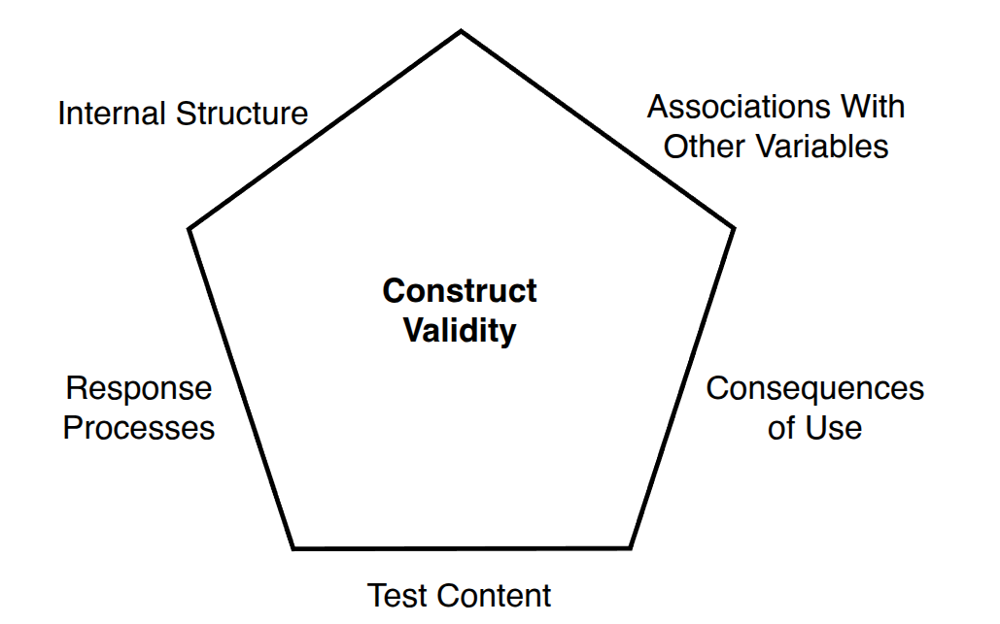
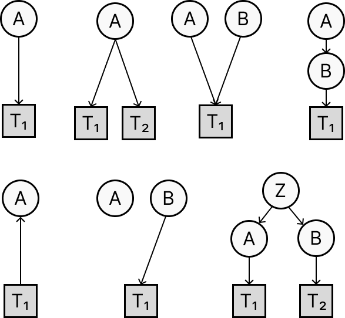
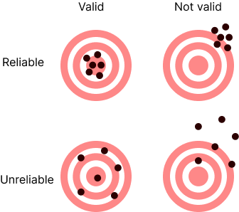
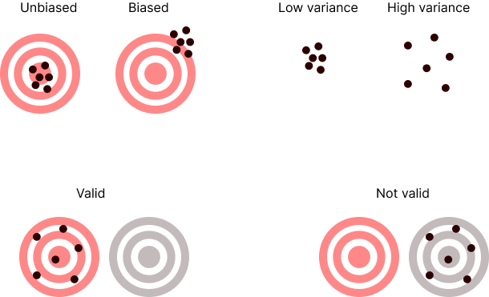

# What is Validity? {.center}

##

"valid" is a term that is used in many different contexts and with rather different meanings (see [Wikipedia/Validity](https://en.wikipedia.org/wiki/Validity)).

 

::: {.fragment}
We will focus specifically on the validity of measurements.
:::

## 

Validity is arguably the **most important** concept in measurement theory.

 

::: {.fragment}

There's a long and complex history in psychology, spanning more than a century—there is still no consensus and lots of confusion.

:::

## 

Overview of key ideas on test validity

1. the classic/simple view (Kelley, 1927)
2. the trinitarian view (Cronbach & Meehl, 1955)
3. the "unified" view (Messick, 1989)
4. the causal view (Borsboom et al., 2004)

## 

References: 

- [slides by Dr. Hurlstone](https://mark-hurlstone.github.io/Week%205.%20Validity%20Theoretical%20Basis.pdf)
- Borsboom, D., Mellenbergh, G. J., & van Heerden, J. (2004). The concept of validity. *Psychological Review*, 111(4), 1061–1071. (on moodle)

# The simple view  {.center}

## {.center}

 

*"A test is valid if it measures what it purports to measure."*

 

Kelley (1927, p. 14)

::: {.footer}
Kelley, T. L. (1927). Interpretation of educational measurements. New York: Macmillan.
:::

## 

This remains the most common definition but this view has been considered too simplistic and not offering guidance on *how* to determine what a test measures.

# The trinitarian view {.center}

## Three types of validity

The 1954 APA Technical Recommendations introduced a tripartite taxonomy:

1. **Content validity**—does the test adequately sample the relevant content domain?

2. **Criterion validity**—does the test predict anything we care about in the real world?

3. **Construct validity**—does the test measure the intended theoretical construct?

::: {.notes}
Note: construct validity acts as an "umbrella"—every other type of validity evidence ultimately contributes to it. The three types are not mutually exclusive; they are complementary.
:::

## {.smaller}

| Type | Subtype | Definition |
|---|---|---|
| **1. Content validity** | "Representativeness" | Does the test adequately sample the relevant content domain? |
| **2. Criterion validity** | Predictive validity | Does the test predict an external criterion measured *in the future*? |
|  | Concurrent validity | Does the test correlate with an external criterion measured *at the same time*? |
| **3. Construct validity** | Convergent validity | Does the test correlate with measures of *related* constructs? |
|  | Discriminant validity | Does the test *not* correlate with measures of *unrelated* constructs? |

 

::: {.fragment}
**Face validity**: Does the test *appear* to measure the right thing (to test-takers)?
:::

## Content validity

- Concerns the **representativeness** of the item sample relative to the domain of interest.
- Typically evaluated through **expert judgment**—experts assess whether items cover all relevant facets of the construct.

::: {.fragment}
Two key threats: **construct-irrelevant content** (items measuring something else) and **construct underrepresentation** (missing important facets).
:::

 

::: {.fragment}
Not to be confused with **face validity**—whether the test *looks* valid to the person taking it.
:::

## a note on "face validity"

::: {.fragment}
Imagine going to a Math exam and getting questions about French grammar. 
What would you do? 
:::

 

::: {.fragment}
What if you're told that scores on French grammar correlate highly with scores on Math?
:::

 

::: {.fragment}

face validity:

- ~acceptability of the test, 
- affects how people will complete the test and thus
- affects the validity of the test.

:::

## Criterion validity

::: {.fragment}
**Predictive validity**: the test predicts a criterion measured in the future.\
  e.g., an intelligence test administered at age 7 correlates with academic performance at 18.
:::

::: {.fragment}
**Concurrent validity**: the test correlates with a criterion measured at the same time.\
  e.g., an intelligence test administered at age 18 correlates with academic performance at 18.
:::

::: {.fragment}
**Postdictive validity**: the test predicts a criterion measured in the past.\
  e.g., an intelligence test administered at age 18 correlates with academic performance at 7.
:::

## Construct validity

Introduced by Cronbach & Meehl (1955):

::: {.fragment}
> "Construct validity must be investigated whenever no criterion or universe of content is accepted as entirely adequate to define the quality to be measured."
:::

::: {.fragment}
The central concept here is called a **nomological network**—it is a theoretical web of laws and relationships in which the construct is embedded.
:::

::: {.footer}
Cronbach, L. J., & Meehl, P. E. (1955). Construct validity in psychological tests. *Psychological Bulletin*, 52(4), 281–302.
:::

## Example {.smaller}

::: {.fragment}
Suppose we develop a new anxiety questionnaire.

Theory* predicts that anxiety should:
:::

::: {.columns}
::: {.column width="50%"}
::: {.fragment}
**Correlate with** (convergent):

- physiological arousal (e.g., sweating, elevated heart rate)
- sleep difficulties and insomnia
- other established anxiety measures (e.g., GAD-7, STAI)
:::
:::

::: {.column width="50%"}
::: {.fragment}
**Not correlate with** (discriminant):

- general intelligence
- school performance
- SES
:::
:::
:::

::: {.fragment}
If observed correlations match this predicted pattern, we have construct validity evidence for the questionnaire.
:::

 
 

::: {.fragment}
*This is made up: not real theoretical predictions.
:::

## The nomological network

- A construct gains meaning through its place in a network of theoretical propositions.
- Validating a test means testing whether it behaves as the theory predicts.
- This is a continuous, never-ending process.

::: {.fragment}
> "[...] construct validation is not accomplished by any single study but is built up over many investigations." (Cronbach & Meehl, 1955)
:::

::: {.footer}
Cronbach, L. J., & Meehl, P. E. (1955). Construct validity in psychological tests. *Psychological Bulletin*, 52(4), 281–302.
:::

## Critique of the trinitarian view

::: {.fragment}
Messick (1995) called the trinitarian approach "fragmented" and "incomplete".
:::

<!--
::: {.fragment}
- Content validity is about *sampling*.
- Criterion validity is about *prediction*.
- Construct validity is about *theory*.
:::
-->

 

::: {.fragment}
Are these really three separate things—or three aspects of one thing? And crucially: none of them considers the **consequences** of test use.
:::

# The Unified View {.center}

## 

::: {.fragment}
Messick (1989) argued that all validity is **construct validity**.
:::

::: {.fragment}
> "Validity is an integrated evaluative judgment of the degree to which empirical evidence and theoretical rationales support the adequacy and appropriateness of inferences and actions based on test scores." (Messick, 1989, p. 13)
:::

::: {.footer}
Messick, S. (1989). Validity. In R. L. Linn (Ed.), *Educational Measurement* (3rd ed., pp. 13–103). American Council on Education.
:::

## Key implications of Messick's view

1. Validity is about **inferences from test scores**, not the test itself.

2. Validity is a matter of **degree**, not a binary property.

3. Validity must take into account the **consequences** of test use.

4. Validity evidence must be continuously accumulated—it is never "established" once and for all.

## 
The five facets of construct validity

::: {.fragment style="font-size: 0.6em;"}
This is very similar to the currently most accepted view:

AERA, APA, & NCME (2014). *Standards for Educational and Psychological Testing*. AERA.

:::

## Evidence based on test content

Does the content of the test represent the intended construct domain?

This is similar to content validity in the trinitarian view.

## Evidence based on response processes

Are test-takers actually engaging in the cognitive processes the construct requires?

You can't just assume that people are going to do what you expect them to do.

e.g., cheating vs not cheating on an exam.
 
 <!--
- Think-aloud / verbal protocol studies
- Cognitive interviews and focus groups
- Response time patterns
- Eye-tracking during test-taking
-->

## Evidence based on internal structure

Do the items and components of the test relate to one another as the theory predicts? This is called **factorial validity**.

::: {.fragment}
Example: the Rosenberg Self-Esteem Inventory (RSEI) measures a *single* coherent construct—so all 10 items should form one tight cluster. A multidimensional inventory should show distinct clusters for each component.
:::

<!--
- Confirmatory factor analysis
- Item fit statistics (IRT)
- Dimensionality analysis
-->

## Evidence based on relations to other variables

Our theory of a construct predicts a specific *pattern* of associations with other variables.

Combines criterion-related and construct validity from the trinitarian view.

## Evidence based on the consequences of use

aka "Consequential validity":  validity includes the **social consequences** of test use.

::: {.fragment}
> "The social consequences of testing [...] are also relevant to validity judgments, not as a separate component but as integral evidence." (Messick, 1989)
:::

::: {.fragment}
Example: a Math test provides accurate measures but demotivates low performers and is used to cut funding to some schools.
:::

::: {.fragment}
This is a controversial issue!
:::

::: {.footer}
Messick, S. (1989). Validity. In R. L. Linn (Ed.), *Educational Measurement* (3rd ed., pp. 13–103). American Council on Education.
:::

# The causal view {.center}

## {.center}

Things have grown out of control, the concept of validity has become too complex and less palatable.

## 

Borsboom, Mellenbergh & van Heerden (2004) proposed a new perspective:

::: {.fragment}
> "A test is valid for measuring an attribute if and only if (a) the attribute exists and (b) variations in the attribute causally produce variations in the measurement outcomes."
:::

::: {.footer}
Borsboom, D., Mellenbergh, G. J., & van Heerden, J. (2004). The concept of validity. *Psychological Review*, 111(4), 1061–1071.
:::

## What this means

1. The attribute must **actually exist**—not just be a convenient theoretical label.

2. Changes in the attribute must **cause** changes in the test scores.

3. This is an ontological claim—validity requires that the world is a certain way.

::: {.fragment}
This is much stronger than Messick's view: validity is not just about inferences, but about **reality**.
:::

::: {.footer}
Borsboom, D., Mellenbergh, G. J., & van Heerden, J. (2004). The concept of validity. *Psychological Review*, 111(4), 1061–1071.
:::

## 
causal diagrams

{width="150%"}

::: {style="font-size: 0.6em;"}
- Is $T_1$ a valid measure of A?
- Are $T_1$ and $T_2$ correlated?
:::

## Criticisms of classic approaches

- everything correlates with everything: nomological approach is not feasible in practice

- correlation is not sufficient: you must demonstrate causality

- theories are generally wrong: so if construct validation fails it's not clear why.

- criterion validity does not imply causality

- perfect correlation does not imply identity (e.g., thunder and lightning)

## Recommendations

- Distinguish "validity" from "validation"

- Use term "valid" for describing the presence or absence of causal influence between construct and measure;

- Use other terms for other aspects (e.g., "quality", "acceptability", "safe").

- Focus more on understanding how exactly a construct causes the responses (i.e., mechanisms, processes) rather than on patterns of correlations between things we don't really understand.

## {.center}

{height="50%" fig-align="center"}

 

How **exactly** do variations in $A$ cause variations in $T_1$? 

##  Reliability + Validity = Confusion

How does validity relate to reliability? 

##

Are they coupled or independent?

{fig-align="center"}

::: {.fragment}

The controversial case: 
can an unreliable measure be valid?

:::

##

my view:

<!-- related to "use simpler terms" -->

<!--
## What do you think? {.center}

- Is validity a property of the test, of the test scores, or of the **inferences** we draw?

- Can a test be valid for one purpose but invalid for another?

- What does it mean for a psychological attribute to "really exist"?

- Does the validity of a test depend on the potential consequences of the use of that test?

-->

 

## Key differences between the different views

- Validity is a property of the **test** vs a property of the **interpretation** of its scores

- Validity is all-or-none (like Truth) vs a **matter of degree**

- Validity is purely psychometric vs includes **social consequences** of test use

- The attribute being measured need only be a theoretical label vs must **actually exist** as a causal entity

- Relationships are causal vs informational

# Homework

## Homework

Based on the 3 views presented: is the tear test a valid test of witchery?  Why?

 

OR

 

Considering the case of the thermometer: which of the views on measurement validity makes most sense to you? Why?

